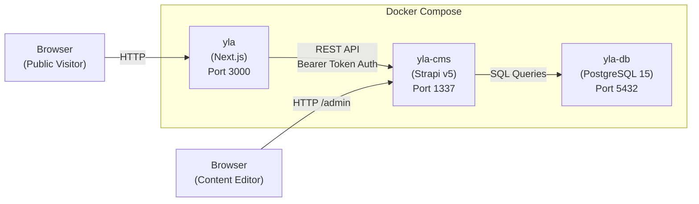

# Overview

## What is YLA App?

YLA App is the web platform for **Sekolah Plus Latansa**, an Islamic school covering Preschool (KB/TK), Elementary (SD), and Middle School (SMP). The system is split into two independent projects:

| Project | Path | Purpose |
|---|---|---|
| **yla** | `yla-app/yla/` | Public-facing school profile website (frontend) |
| **yla-cms** | `yla-app/yla-cms/` | Content management system (backend) |

### School Profile — `yla/`

The frontend is a server-rendered Next.js application that serves as the school's public website. It displays:

- A homepage with a video hero, school values, achievements, and latest news articles
- Dedicated landing pages for each education level (Preschool, Elementary, Middle School)
- A news/article detail page that renders rich content blocks from the CMS

The site is primarily in Indonesian and targets prospective parents, students, and the school community.

### CMS — `yla-cms/`

The backend is a Strapi v5 headless CMS that provides:

- A REST API consumed by the frontend to fetch articles, categories, authors, and site settings
- An admin panel for content editors to manage all content without touching code
- Support for rich content blocks: rich text, media, quotes, and image sliders
- Draft and publish workflow for articles

---

## Tech Stack

### Frontend (`yla/`)

| Technology | Version | Purpose |
|---|---|---|
| Next.js | 15.4.2 | React framework with App Router and Turbopack |
| React | 19.1.0 | UI library |
| TypeScript | ^5 | Type safety |
| Tailwind CSS | v4.1.11 | Utility-first CSS framework |
| shadcn/ui | new-york style | Pre-built UI components (based on Radix UI) |
| Radix UI | — | Accessible headless UI primitives (Dialog, Tabs, Slot) |
| Lucide React | — | Icon library |
| class-variance-authority | — | Component variant styling |

### Backend (`yla-cms/`)

| Technology | Version | Purpose |
|---|---|---|
| Strapi | v5.23.4 | Headless CMS framework |
| PostgreSQL | 15 | Relational database |
| Node.js | 18–22 | Runtime |
| TypeScript | ^5 | Type safety |

### Infrastructure

| Technology | Purpose |
|---|---|
| Docker | Containerization for each service |
| Docker Compose | Multi-service orchestration |

---

## Architecture

The system runs as 3 Docker services connected on an internal network:

### How the Services Connect

1. **`yla-db`** (PostgreSQL) starts first — it holds all CMS data (articles, authors, categories, site settings).
2. **`yla-cms`** (Strapi) starts after `yla-db` — it connects to PostgreSQL and exposes a REST API on port `1337`, plus an admin panel at `/admin`.
3. **`yla`** (Next.js) starts after `yla-cms` — it fetches content from the Strapi API using a Bearer token for server-side requests and renders pages for public visitors on port `3000`.

### Data Flow

- **Server-side rendering (homepage)**: Next.js server components call `yla-cms:1337/api/articles` with a Bearer token during page render. The response is used to build the HTML sent to the browser.
- **Client-side fetching (news detail)**: The news detail page is a client component that fetches a single article from the Strapi API after the page loads.
- **Content management**: Editors log into the Strapi admin panel directly at `yla-cms:1337/admin` to create and manage content. Changes are persisted to PostgreSQL and immediately available to the frontend.
