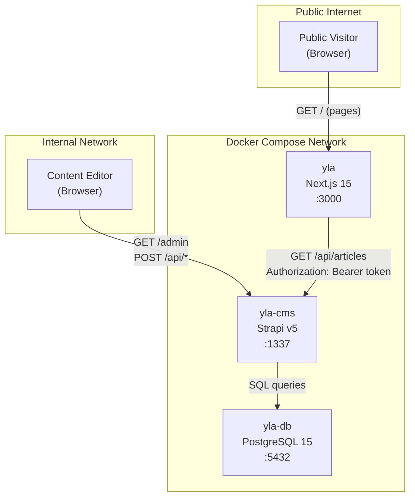
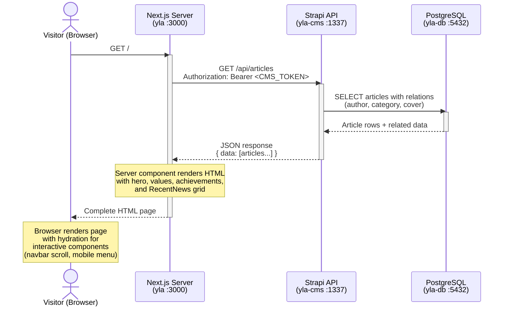
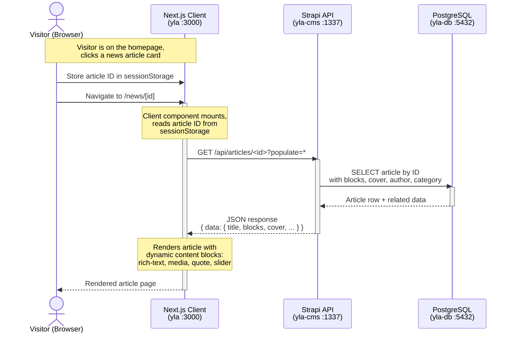
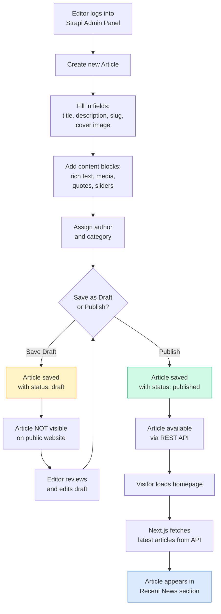

# Use Cases & Diagrams

## Use Cases

### Use Case 1: Public Visitor Browses the School Website

A prospective parent or student visits the school website to learn about Sekolah Plus Latansa.

**Actor**: Public visitor (unauthenticated)

**Actions**:
- Views the homepage with video hero, school values, achievements, and latest news
- Navigates to education level pages (Preschool, Elementary, Middle School) to learn about specific programs
- Clicks on a news article to read the full content with rich text, images, quotes, and media
- Clicks "Daftar Sekarang" (Enroll Now) to begin enrollment (planned feature, not yet implemented)

---

### Use Case 2: Content Editor Manages Articles

A school staff member uses the CMS admin panel to publish news and updates.

**Actor**: Content editor (authenticated via Strapi admin)

**Actions**:
- Logs into the Strapi admin panel at `/admin`
- Creates a new article with title, description, slug, cover image, and content blocks (rich text, media, quotes, sliders)
- Assigns the article to an author and a category (e.g., news, tech, nature)
- Saves as draft for review, or publishes immediately
- Edits or unpublishes existing articles
- Manages authors (name, email, avatar) and categories (name, slug, description)

---

### Use Case 3: Site Administrator Manages Global Settings

An administrator configures site-wide settings and metadata.

**Actor**: Site administrator (authenticated via Strapi admin)

**Actions**:
- Updates the global site name, description, and favicon
- Configures default SEO metadata (meta title, meta description, share image)
- Manages the About page content using dynamic content blocks
- Manages user roles and permissions for other content editors
- Generates and manages API tokens for frontend access

---

## Diagrams

### 1. System Architecture Diagram

High-level view of how the three services interact:

---

### 2. Sequence Diagram: Visitor Loads Homepage

This diagram shows what happens when a public visitor loads the school homepage. The homepage is a Next.js server component that fetches the latest articles from Strapi during server-side rendering.

---

### 3. Sequence Diagram: Visitor Reads a News Article

This diagram shows the client-side flow when a visitor clicks on a news article from the homepage.

---

### 4. Flow Diagram: Content Editor Publishes an Article

This diagram shows the editorial workflow from creating a draft article to it appearing on the public website.

